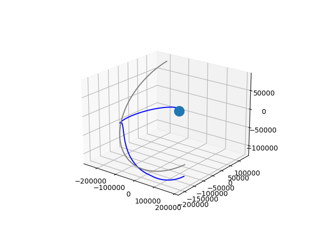

# trackorion
python program to track orion spacecraft and the moon with information from https://ssd.jpl.nasa.gov/horizons/

It uses astroquery to make queries to nasa horizons system.

It uses matplotlib to draw a 3D plot with the trajectory of orion and the moon. You get something like this (this is up to November 29):



Moon is the gray trajectory, blue is for Orion, and the small blue sphere represents the earth (not in real scale). This is at 17:00 of Monday 5 of December:


And this at 23:00 of Friday 9 of December, coming home ! :


## Usage
Must specify starting and ending dates:

```bash
python3 ./trackorionandmoon.py 2022-11-16 09:03:00 2022-11-28 0:0:0
```

According to the information from Horizons, the first available date for orion is 2022-NOV-16 09:03:00.0000 TDB  (times assumed to be in TDB time)
